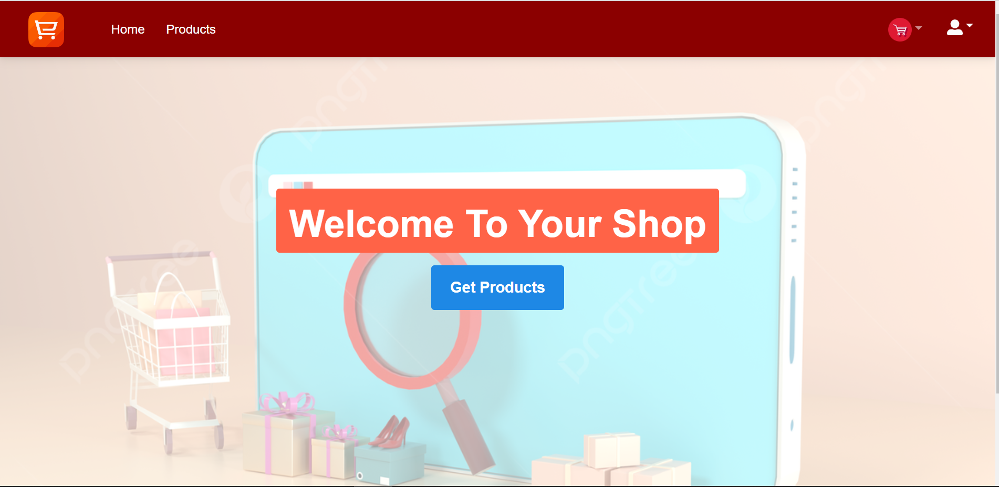
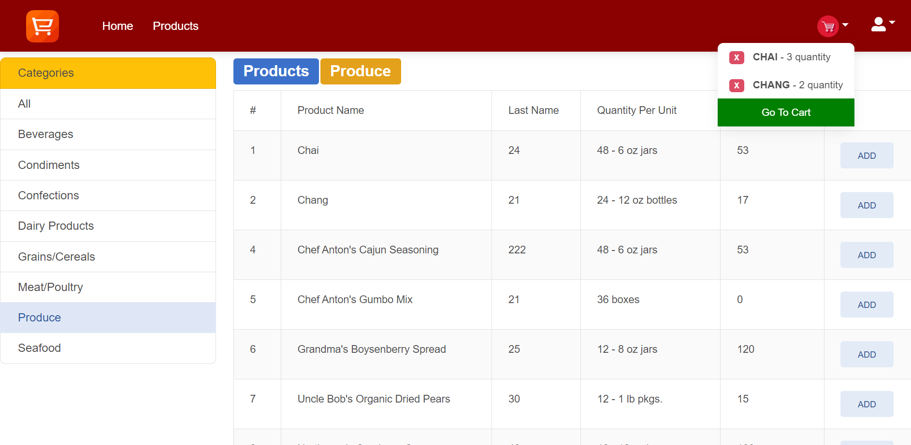
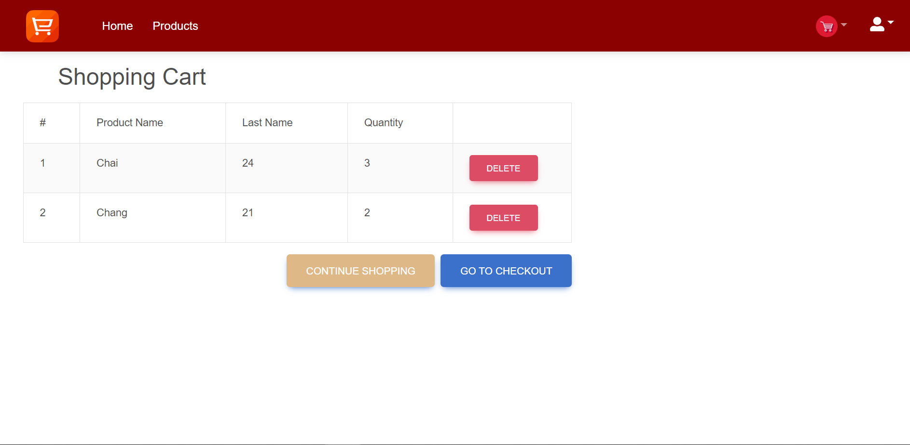
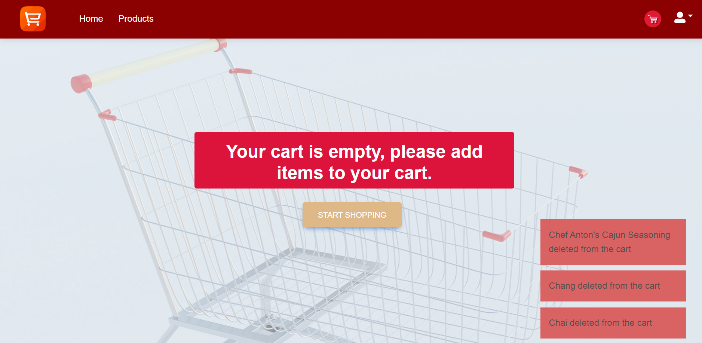
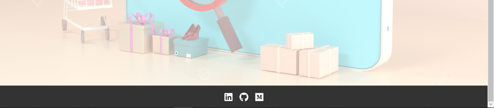

# Shopping App

https://canozgen-shopping-app.netlify.app/

This is a shopping application built with React js. Redux is used as state management. 

## Features

* You can go to the products page and select the category you want and you can add the products you want from the category you selected to the cart.

* You can view the cart from the cart icon in the navbar and you can also go to the cart page if you want

* You can delete the product from the cart both from the icon in the navbar and from the cart page.
* You will be notified when adding items to the cart and deleting items from the cart.

* You can reach my social media accounts from the icons in the footer.

